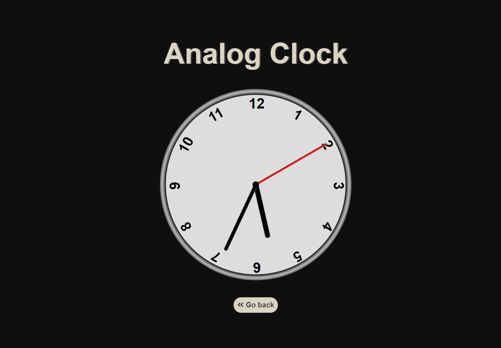
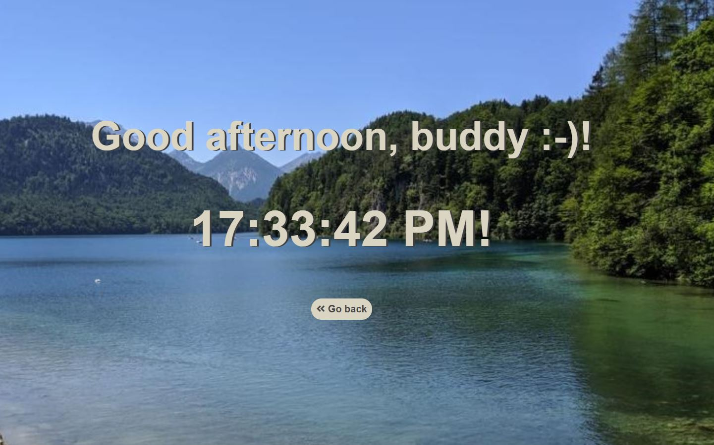
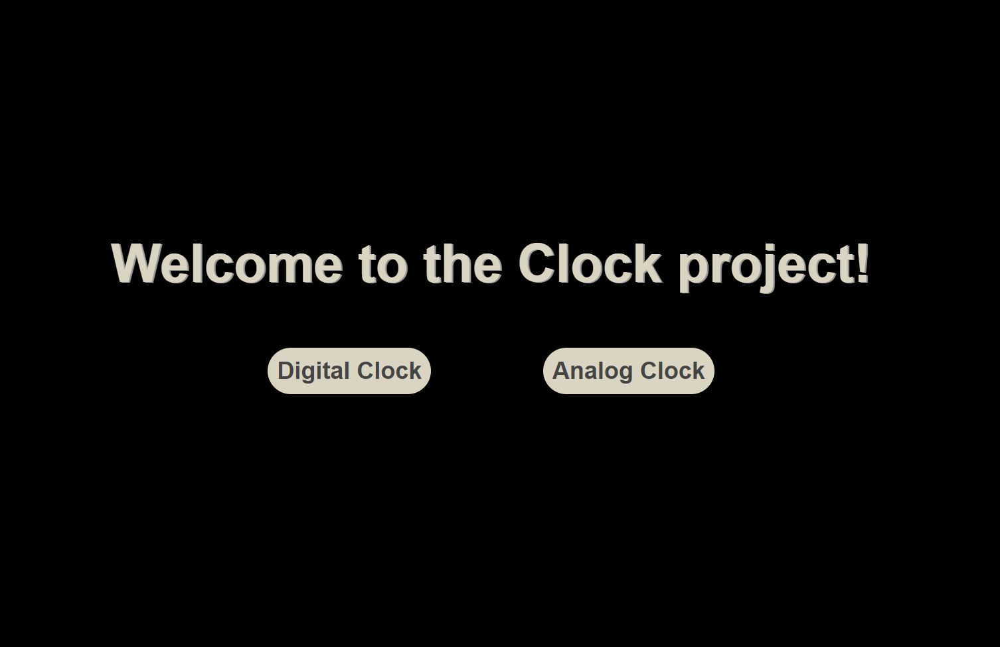

## Clock.js

This project is build to display the clock as hh/mm/ss in digital and analog format. 

The digital format also change the background image and display a message depending on the time of day.

